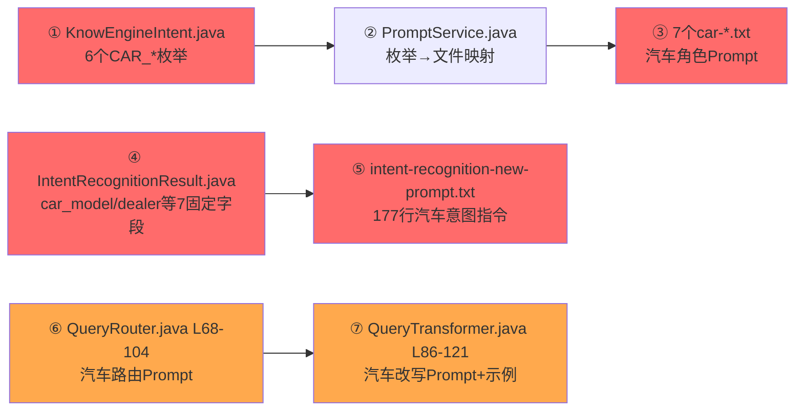
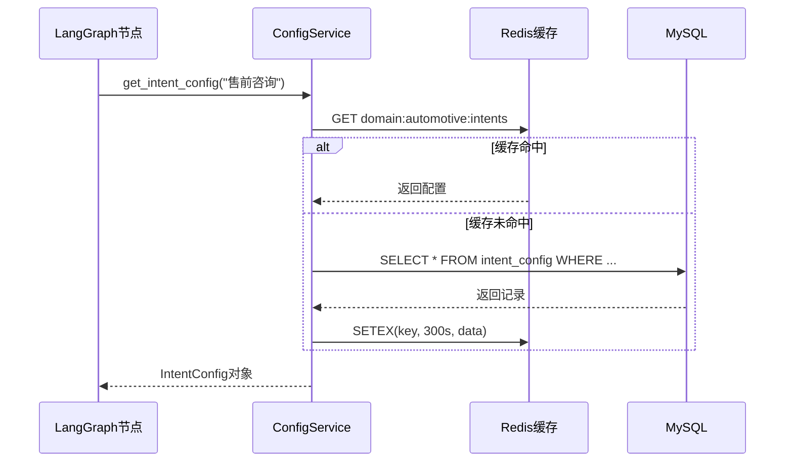
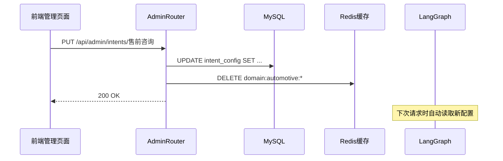
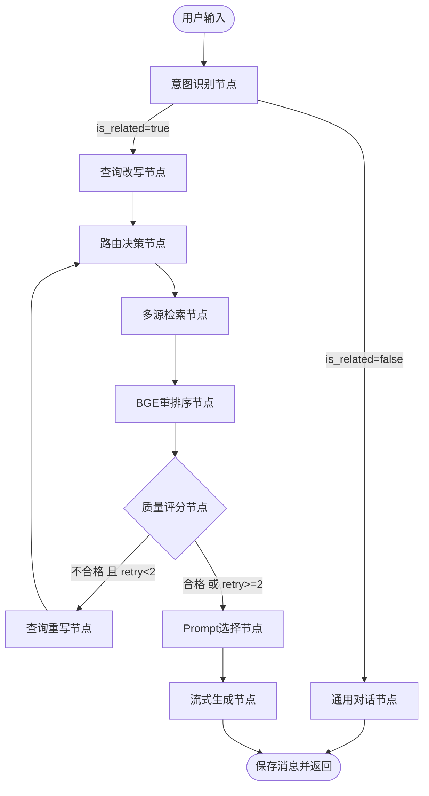
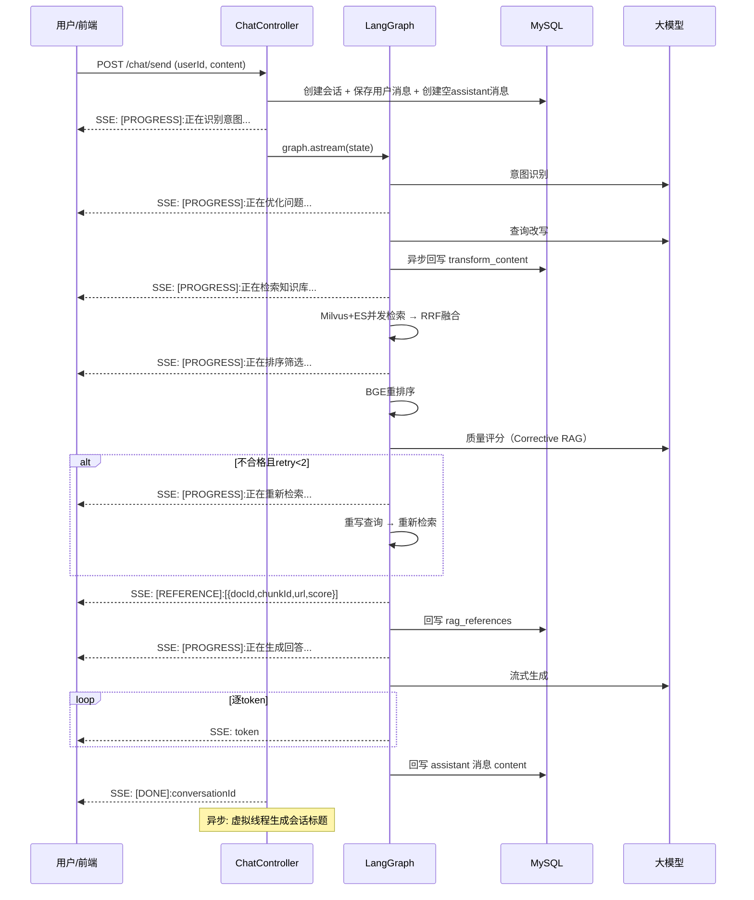

# Know-Engine 改造大纲（完整版）

> **Java 原版最新状态**：对话管线已补全（`229f7dc`/`81ed40c`/`b5e0d97` 三次提交），ChatController.send() 不再是 TODO。
> **改造性质**：从"补全"变为"架构升级"。
> **版本基线**：`langchain==1.2.x` | `langgraph==1.1.x` | `Python>=3.10`

---

## 一、Java 原版问题分析

### 1.1 功能完整性

Java 版在最新提交后已实现完整 RAG 闭环：

```
ChatController.send() → 意图识别 → 不相关→通用对话 / 相关→RAG管线
                                                    ↓
                                    QueryTransformer → QueryRouter → 4路检索
                                    → ReRanking → ContentAggregator → LLM流式生成
```

新增关键文件：`ChatApplicationService`(203行)、`ProgressAwareContentAggregator`(101行)、`ProgressAwareContentRetriever`(79行)，实现了进度推送(`[PROGRESS]`)、RAG引用溯源(`[REFERENCE]`)、LLM回答持久化。

### 1.2 仍然存在的6大问题

| # | 问题 | 具体表现 | 影响 |
|---|------|---------|------|
| 1 | **深度绑定汽车领域** | 7处硬编码（详见§三），加意图需改Java重编译 | 无法换领域 |
| 2 | **ES 职责混乱** | 同一 ES 实例同时做 KNN向量+BM25全文，耦合在 `KnowEngineElasticsearchContentRetriever`(281行) | 无法独立优化 |
| 3 | **无检索质量控制** | 检索结果直接送入生成，没有相关性评分或重试 | 低质量上下文致幻觉 |
| 4 | **线性管道无循环** | `DefaultRetrievalAugmentor` 是单向管道，无法"检索不好→重写→再检索" | 无法自修正 |
| 5 | **文档解析强依赖GPU** | `MinerUProcessBaseServiceImpl`(572行) 需自建 MinerU GPU 服务 | 部署门槛高 |
| 6 | **定时任务重依赖** | `DocumentCompensationJob` 绑定 XXL-Job | 需完整 XXL-Job 集群 |

---

## 二、改造的三个核心目标

| # | 目标 | Java 现状 | Python 改造后 |
|---|------|-----------|-------------|
| 1 | **对话管线升级** | `DefaultRetrievalAugmentor` 线性管道 | LangGraph `StateGraph` **循环状态机** + Corrective RAG |
| 2 | **领域可配置化** | 7处汽车硬编码 | DB + API + Redis缓存，前端可配置 |
| 3 | **检索引擎解耦** | ES 混用向量+全文 | Milvus(向量) + ES(关键词) + RRF融合 |

---

## 三、7处汽车硬编码精确定位



**每个硬编码的改造去向**：

| # | 文件 | 硬编码 | → 改造目标 |
|---|------|--------|-----------|
| ① | `KnowEngineIntent.java` L5-50 | 6个 `CAR_*` 枚举 + switch-case | → DB `intent_config` 表 |
| ② | `PromptService.java` L38-49 | 枚举→txt 文件路径 + fallback `CAR_OTHER_QUERY` | → DB `prompt_template` + Redis 缓存 |
| ③ | 7个 `car-*.txt` | "汽车销售顾问""汽车技术工程师"等角色 | → DB `prompt_template` 表 prompt_type=chat |
| ④ | `IntentRecognitionResult.Entities` L26-46 | `car_model`/`dealer`/`fault_description` 等7个固定字段 | → DB `domain_config.entity_schema` JSON 动态字段 |
| ⑤ | `intent-recognition-new-prompt.txt` 177行 | 汽车意图类别+20个few-shot | → DB基础描述 + 意图列表从 `intent_config` 表**自动拼装** |
| ⑥ | `KnowEngineQueryRouter` L68-104 | 内嵌"汽车领域智能助手"路由Prompt | → DB `prompt_template` prompt_type=query_route |
| ⑦ | `KnowEngineQueryTransformer` L86-121 | 内嵌汽车改写Prompt+示例 | → DB `prompt_template` prompt_type=query_transform |

---

## 四、动态配置架构设计

### 4.1 新增3张配置表

```sql
-- 领域配置表
CREATE TABLE domain_config (
    domain_id VARCHAR(64) UNIQUE NOT NULL,      -- 'automotive'
    name VARCHAR(128) NOT NULL,                  -- '汽车智能客服'
    entity_schema JSON,                          -- 动态实体字段定义
    fallback_intent VARCHAR(128) DEFAULT '其他',
    is_active TINYINT DEFAULT 1
);

-- 意图配置表（替代 KnowEngineIntent 枚举）
CREATE TABLE intent_config (
    domain_id VARCHAR(64) NOT NULL,
    intent_name VARCHAR(128) NOT NULL,           -- '售前咨询与购买'
    intent_description VARCHAR(512),             -- 给LLM看的描述
    retrieval_strategy VARCHAR(32) DEFAULT 'hybrid', -- hybrid/sql/graph
    data_sources VARCHAR(256) DEFAULT '["milvus","es"]',
    sort_order INT DEFAULT 0,
    UNIQUE KEY (domain_id, intent_name)
);

-- Prompt模板表（替代7个car-*.txt + 内嵌Prompt）
CREATE TABLE prompt_template (
    domain_id VARCHAR(64) NOT NULL,
    intent_name VARCHAR(128) NOT NULL,           -- '_system_' 表示系统级
    prompt_type VARCHAR(32) NOT NULL,            -- chat/intent_recognition/query_route/query_transform/grader
    content TEXT NOT NULL,
    version INT DEFAULT 1,
    is_active TINYINT DEFAULT 1
);
```

### 4.2 配置读取链路



### 4.3 配置热更新链路



### 4.4 意图识别 Prompt 自动拼装

关键设计：前端新增一个意图后，意图识别Prompt会**自动包含**新意图，不需要手动改Prompt。

```
最终Prompt = DB中的基础角色描述
           + "\n## 意图类别\n"
           + 遍历 intent_config 表动态生成的意图列表
           + "\n## 实体提取\n"
           + 遍历 domain_config.entity_schema 动态生成的实体指令
```

### 4.5 前端管理界面功能

```
领域管理页面
├── 基本信息（名称、描述、启用状态）
├── 实体字段配置（JSON编辑器）
├── 意图管理
│   ├── 列表（增删改查 + 拖拽排序）
│   │   ├── 意图名称 / 描述
│   │   ├── 检索策略（hybrid/sql/graph 下拉）
│   │   ├── 数据源（多选：milvus/es/mysql/neo4j）
│   │   └── 关联Prompt（链接到编辑器）
└── Prompt管理
    ├── 系统级（意图识别/路由/改写/评分）
    ├── 意图级（每个意图的聊天Prompt）
    ├── 在线编辑器 + 预览
    └── 版本历史 + 一键回滚
```

---

## 五、LangGraph 状态机设计

### 5.1 Java 版 vs Python 版对比

```
Java版（线性管道，DefaultRetrievalAugmentor）：
intent → transform → route → retrieve(4路) → rerank+aggregate → generate

Python版（循环状态机，StateGraph + Corrective RAG）：
intent → transform → route → retrieve(Milvus+ES+SQL+Neo4j)
  → rerank → grader → (不合格? → rewrite → route → ...) → prompt_select → generate
                       ^^^^^^^^^^^^^^^^^^^^^^^^^^^^^^^^
                       新增：质量评分 + 循环重试（最多2次）
```

### 5.2 状态机流程图



### 5.3 SSE 对话时序图



---

## 六、检索引擎解耦设计

### 6.1 Java vs Python 对比

| 维度 | Java 版 | Python 改造版 |
|------|---------|-------------|
| 向量检索 | ES KNN | **Milvus** ANN |
| 关键词检索 | ES BM25 | **ES** BM25（ik_smart） |
| 融合策略 | 无 | **RRF** (k=60) |
| 上下文扩展 | ES 内部 parentChunkId 查询 | Milvus命中→ES取父/兄弟chunk |

### 6.2 双写流程

```
文档分段完成后：
├── skipEmbedding=false 的子chunk → embedding → 写入 Milvus
├── 所有 chunk（含父chunk）→ 原文+metadata → 写入 ES
```

### 6.3 检索+扩展流程

```
用户查询
├── Milvus 语义检索 → 命中子chunk
│   ├── parentChunkId → 从ES取父chunk完整内容（替换子chunk片段）
│   └── brotherChunkId → 从ES取同级兄弟chunk（补充上下文）
├── ES BM25 关键词检索
└── RRF 融合排序 → 去重 → 返回 top-K
```

---

## 七、技术栈与版本

| 组件 | Java 原版 | Python 改造版 |
|------|-----------|-------------|
| AI 框架 | LangChain4j 1.11.0 | **LangChain 1.2.x + LangGraph 1.1.x** |
| 管道架构 | DefaultRetrievalAugmentor | **StateGraph（循环状态机）** |
| 流式输出 | Reactor Flux + SSE | FastAPI SSE + graph.astream() |
| 向量存储 | ES KNN | **Milvus** |
| 关键词 | ES BM25 | ES BM25（保留） |
| Reranker | ONNX BGE | sentence-transformers CrossEncoder |
| 文档解析 | MinerU GPU 自建 | **MinerU 在线API** |
| 任务调度 | XXL-Job | **Celery + Beat** |
| ORM | MyBatis-Plus | SQLAlchemy 2.0 async |
| Python | - | **>=3.10** |

---

## 八、完整文件映射（62→45个 Python 文件）

### 直接平移（35个）
基础设施(3) + 文档管理(22) + 聊天会话(7) + 工具类(3)

### 核心改造（10个）
- `ChatApplicationService`(203行) → `rag/graph.py`（StateGraph编排）
- `ProgressAwareContentAggregator`(101行) → 溯源逻辑融入 `reranker_node.py`
- `ProgressAwareContentRetriever`(79行) → 进度推送融入各 retriever node
- `KnowEngineQueryRouter`(147行) → `router_node.py`（DB驱动替代LLM路由）
- `KnowEngineQueryTransformer`(182行) → `transform_node.py`
- `IntentRecognitionService` → `intent_node.py`
- `KnowEngineElasticsearchContentRetriever`(281行) → `milvus_retriever.py` + `es_retriever.py` + `hybrid_retriever.py`
- `BgeScoringModel` → `reranker_node.py`
- `KnowEngineIntent` + `PromptService` → `DomainConfigService` + `PromptService`（DB驱动）

### 新增（5个）
- `grader_node.py` — 质量评分（Corrective RAG）
- `rewrite_node.py` — 查询重写（循环重试）
- `prompt_select_node.py` — Prompt 动态选择
- `admin_router.py` — 领域管理API（9个接口）
- `state.py` — AgentState 定义

---

## 九、分阶段路线图

| Phase | 周期 | 内容 | 验证标准 |
|-------|------|------|---------|
| 1 骨架 | W1-2 | 项目结构+ORM(8表)+配置服务+种子数据+领域管理API(9接口) | API可调通，种子数据自动导入 |
| 2 文档 | W3-4 | MinIO+MinerU在线API+3个分割器+双写Milvus+ES+Celery | 上传PDF→全链路跑通 |
| 3 检索 | W5-6 | Milvus/ES/Hybrid/SQL/Neo4j检索器+RRF+BGE重排 | 输入查询→返回排序文档 |
| 4 图编排 | W7-8 | LangGraph 11节点+Corrective RAG循环+进度推送 | 端到端：查询→意图→检索→评分→生成 |
| 5 对话 | W9 | SSE流式+会话管理+消息持久化+RAG溯源+标题生成 | `/chat/send` 完整流式返回 |
| 6 部署 | W10 | Docker Compose+单元测试+端到端验证 | 全链路冒烟通过 |
